# **コウモリラン（ビカクシダ）栽培 × 電子工作：育成環境のスマート化プロジェクト**
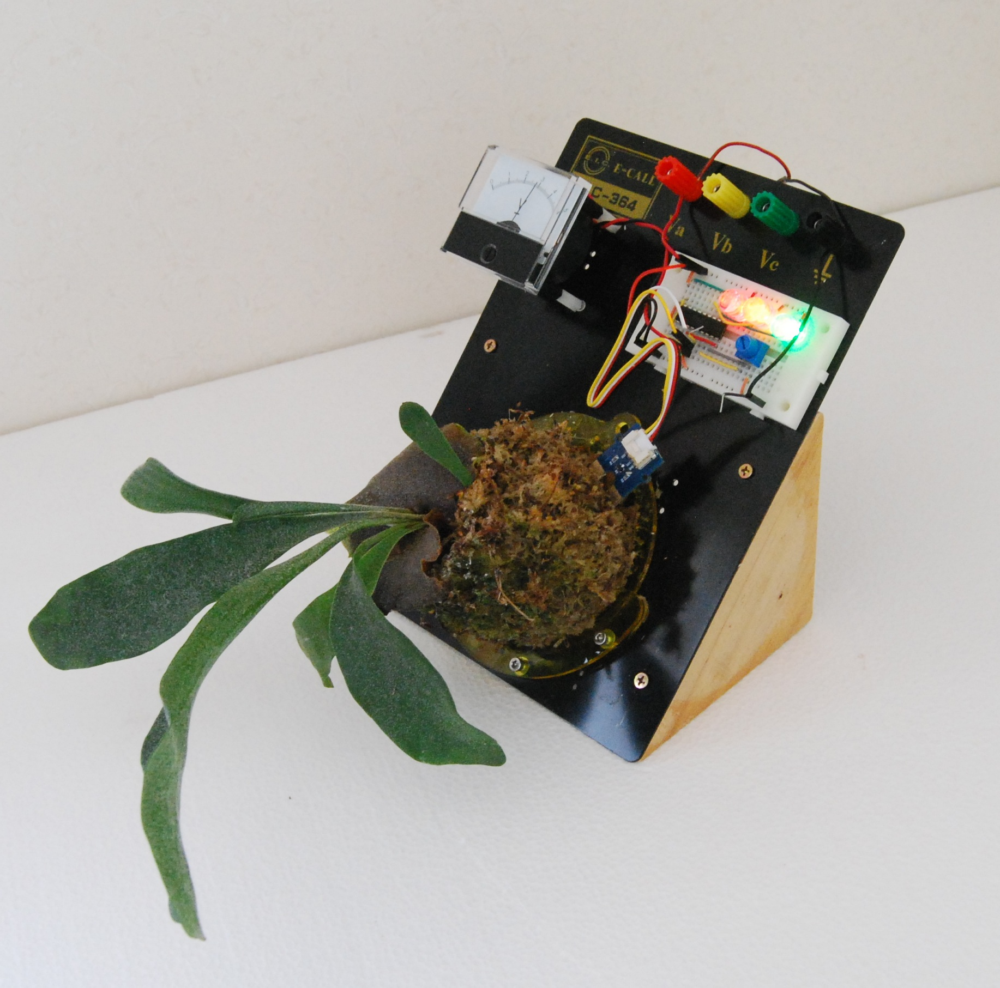

近年人気が高まっている観葉植物、コウモリラン（ビカクシダ）。その独特な草姿から多くの愛好家がいます。本プロジェクトでは、コウモリランを単に板付けや苔玉にして観賞するだけでなく、電子工作の技術を組み合わせることで、育成環境をより深く理解し、管理をサポートする「電脳化」に挑戦します。

コウモリランは着生植物であり、適切な水分管理が育成の鍵となります。この管理を電子工作でサポートすることで、育成の助けとなることを目指します。本プロジェクトでは、簡単な水分センサーの表示から始め、徐々に機能を発展させていく過程を記録しています。プロジェクトはまだ製作過程であり、今後も更新していく予定です。

## **第一歩：水分量の可視化**

まずは、コウモリランの育成において最も重要な要素の一つである「水分量」をアナログ的に表示することからスタートしました。

### **1\. 苗の準備**

手始めに、ホームセンターでコウモリランの「ネザーランド」という品種を入手しました。この品種は比較的安価で手に入りやすく、丈夫なため初心者にもおすすめです。

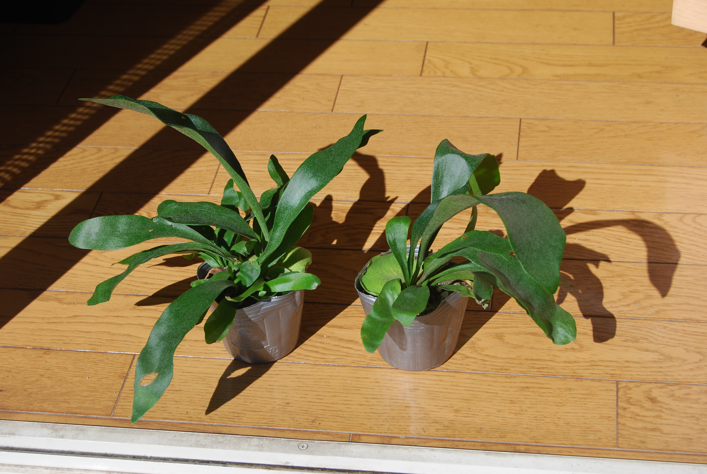

### **2\. 下準備と板付け**

購入した苗の根鉢から丁寧に古い土を落とします。その後、数時間かけて水で戻した水苔で根を包み込み、板に固定します。今回は、電子工作で良く使用するアクリル板で専用のベースを自作し、そこに取り付けました。この際、水苔内に土壌水分センサーを挿入し、水分量を測定できるように準備します。

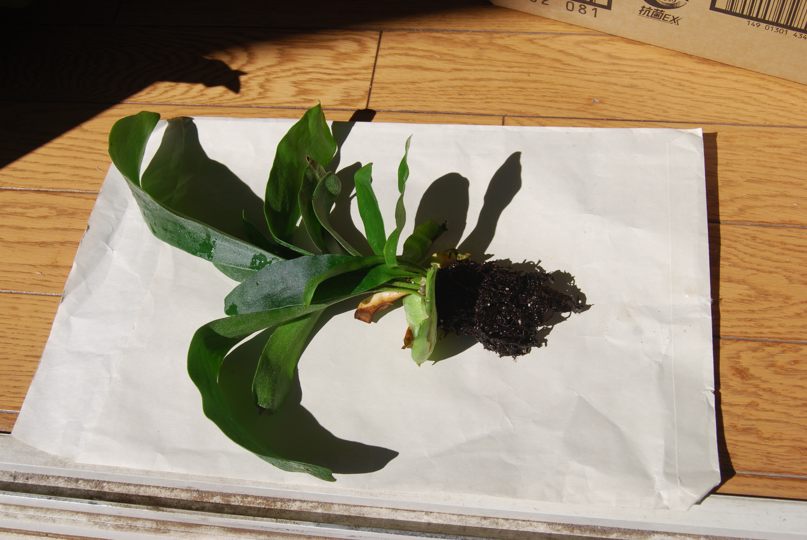

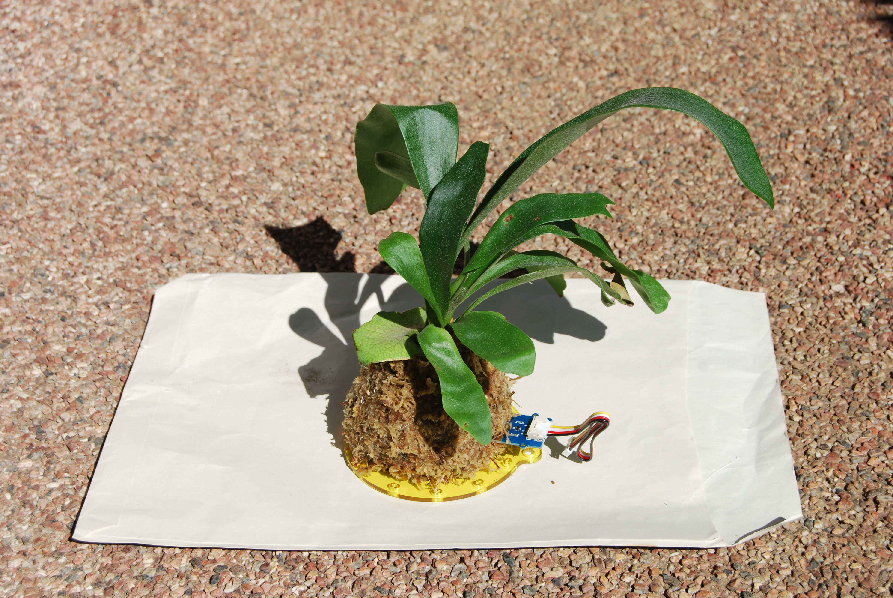

### **3\. 水分量表示回路の製作**

ジャンク品のブレッドボードの板を利用し、水分量センサーの値を電圧として読み取り、その結果をLEDで表示する簡単なアナログ回路を組みました。LEDの表示には、オーディオ機器で使われるレベルメーターIC（例：LM3914やLM3915など）を活用し、水分量に応じて点灯するLEDの数が変わるようにしました。例えば、青色のLEDが多く点灯していれば水分が十分ある、という目安になります。

写真でメインの株とは別にぶら下がっている小さな苔玉は、水分量センサーの動作テストや比較検討のために特別に用意したものです。

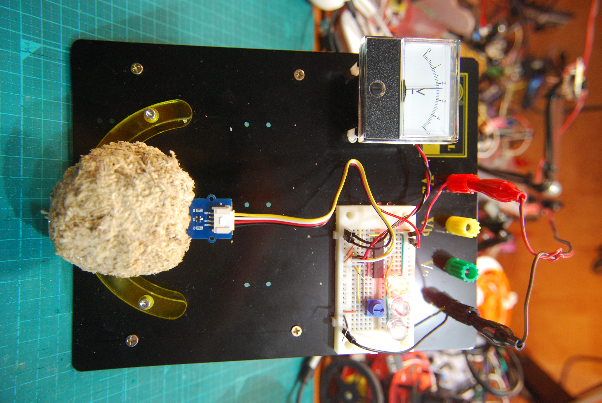

### **4\. 水分量センサーの比較検討**

コウモリランの育成環境に適した水分量センサーを選定するため、2種類のセンサーを比較しました。

* 左側：Groveシリーズの**抵抗式センサー**  
* 右側：Cytoron製の**静電容量式センサー**

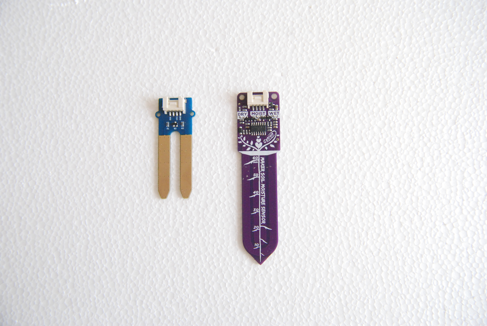

水苔は乾燥すると体積が収縮するという特性があります。この収縮により、センサーと水苔の接触状態が変化し、測定値に影響を与える可能性があります。  
今回の実験では、静電容量式センサーの場合、水苔の収縮による密着度の変化がセンサーの静電容量値に大きく影響し、期待した測定値が得られにくい（誤検知しやすい）という結果になりました。抵抗式センサーも接触状態に左右されますが、今回の環境では比較的安定した傾向が見られました。センサーの原理と設置方法、そして育成する素材の特性を考慮した選定が重要であることが分かりました。

## **ステップアップ：マイコンボードによる多機能化**

アナログ回路での基本的な水分検知に続き、さらなる「電脳化」を目指し、マイコンボードを導入しました。

### **1\. 「Grove Beginner Kit for Arduino」の活用**

今回は「Grove Beginner Kit for Arduino」を使用しました。このキットは、水分センサーのほか、温度センサー、湿度センサー、気圧センサー、照度センサーなど、植物の栽培管理に役立つ様々なセンサーが一通り揃っており、コネクタ接続で容易に扱えるため、電子工作初心者や手軽に多機能なシステムを構築したい方におすすめです。  
設置用として、アクリル板で専用のアクリルスタンドを製作しました。  

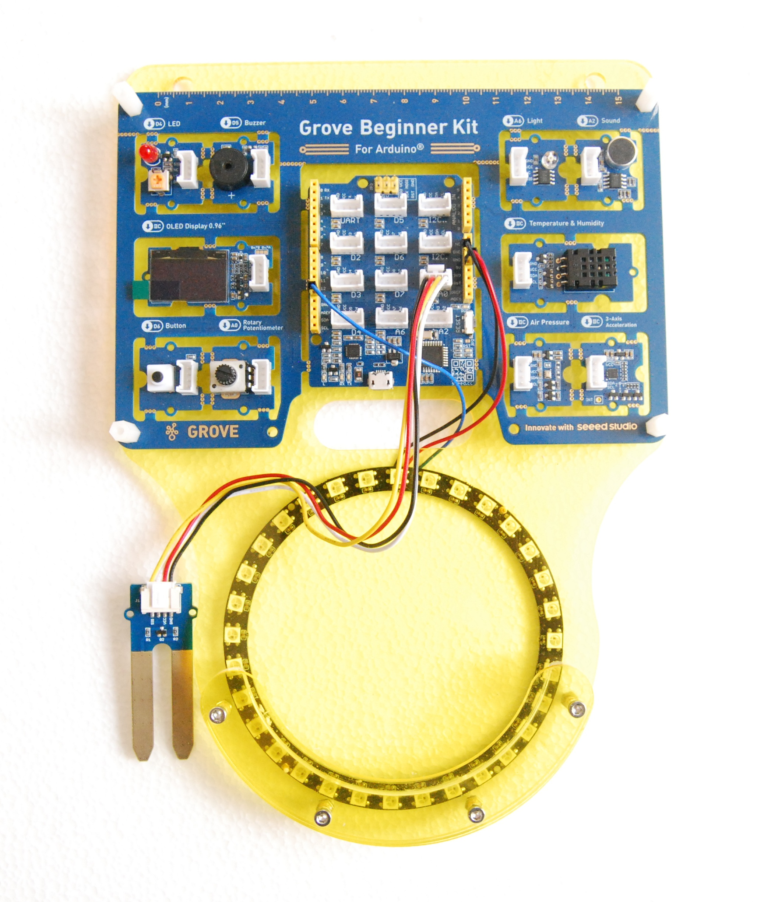

### **2\. 複数センサーによる環境モニタリングと視覚化**

このキットを利用することで、水分量だけでなく、温度、湿度、気圧、照度といった複数の環境要因を同時に測定し、そのデータをプログラムで処理することが可能になります。測定結果は、キットに含まれる小型の液晶ディスプレイ（LCD）に表示できます。

さらに、測定データやコウモリランの状態をより直感的に把握できるよう、フルカラーLEDであるNeoPixel（ネオピクセル）を追加。これにより、水分が不足していれば赤色、快適な環境であれば緑色に光るなど、様々な色やパターンで情報を視覚的に表現できるようになりました。

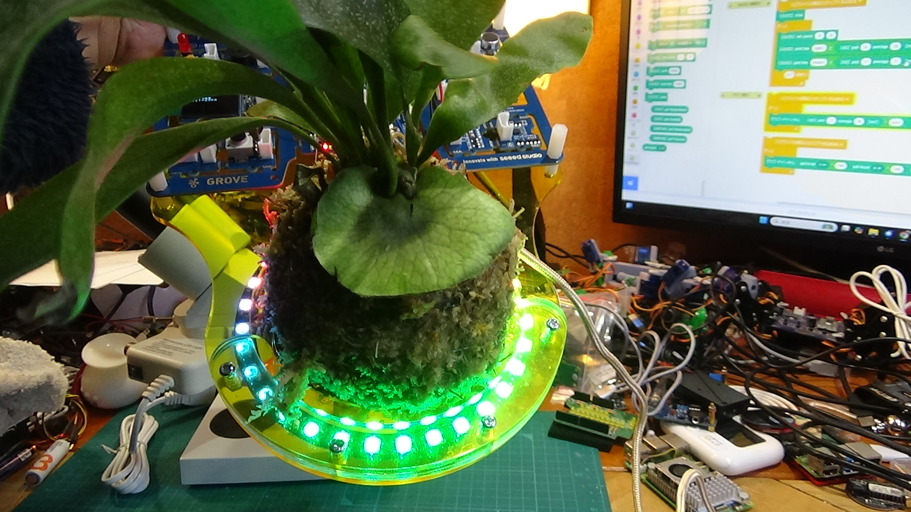

### **3\. プログラミング環境**

Arduino IDEを用いたC++ライクな言語でのプログラミングに加え、**そーたメイ**さんが開発されたブロックプログラミング環境\*\*「つくるっち」\*\*にも対応しており、より手軽にプログラミングに親しむことができます。

## **さらなる進化：ESP32-S3とAI連携への挑戦**

プロジェクトをさらに進化させるため、より高性能なマイクロコントローラを導入しました。

### **1\. 「M5StampS3 ラウンド液晶モジュール」による表現力向上**

Wi-FiやBluetooth機能を搭載したESP32-S3マイクロコントローラと円形液晶ディスプレイが一体となった\*\*「M5StampS3 ラウンド液晶モジュール」\*\*を採用しました。これにより、コウモリランの現在の状態を「ご機嫌メーター」としてアニメーションやアイコンで表示するなど、よりリッチで表現力豊かなユーザーインターフェースの実現を目指しています。

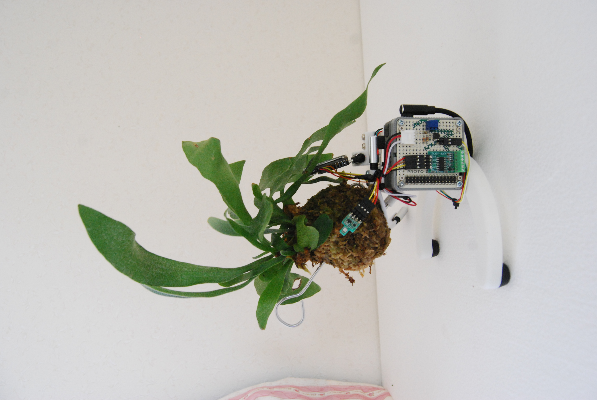

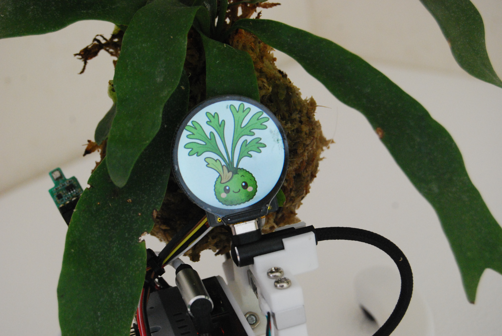

### **2\. ローカルLLMによるAI化への挑戦**

現在、M5StackのLLM（大規模言語モデル）モジュールを接続し、ローカル環境で動作するAIを活用して、コウモリランの状態を分析し、育成に関するアドバイスを生成するような機能の開発に挑戦中です。これにより、より双方向的でインテリジェントな栽培サポートシステムの構築を目指します。

## **デザイン試作：浮遊するコウモリラン？**

機能面だけでなく、見た目の楽しさも追求しています。こちらの試作品では、コウモリランがあたかも宙に浮いているように見えるような、ユニークな展示方法を模索しています。

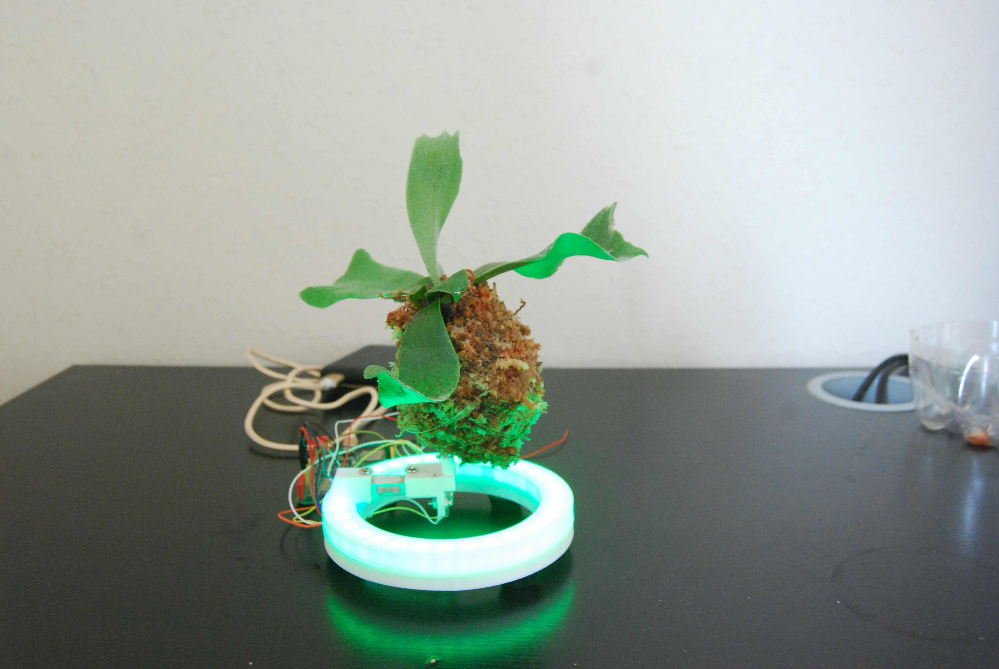

## **今後の展望**

本プロジェクトはまだ開発の途上にあります。今後も機能の追加や改良を重ね、コウモリラン栽培をより楽しく、よりスマートにするためのアップデートを続けていく予定です。進捗は随時更新してまいりますので、ご期待ください。

## 

**なお、M5StampS3 ラウンド液晶モジュールは以下で販売しています**

* M5StampS3実装品: [https://www.switch-science.com/products/8971](https://www.switch-science.com/products/8971)  
* M5StampS3未実装品: [https://www.switch-science.com/products/8851](https://www.switch-science.com/products/8851)

## **製作者**

ウルカテクノロジー     Hiroyuki Sunagawa  
https://www.facebook.com/URUKA-Technologies-105478404379918